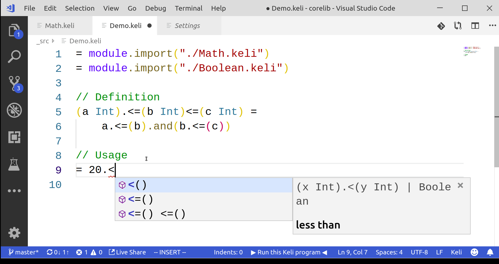

# Interval comparison operator for free!

### Introduction

If you had used Python before, you might have encountered a syntax sugar so called the Interval Comparison Operator, which is very convenient for checking if an integer is within a specific range.

For example,

```python
if 80 <= grade <= 100:
    print("You got A!")
else:
    print("Sorry, not A ...")
```

This is one of the nicest feature that Python has, however, it is not possible to be implemented in other language without performing some macro magic or modifying the internal parser. 

But guess what? You can have that for free in Keli!

Because those operators can be defined as usual functions, as follows:

```c
// Definition
(a Int).<=(b Int)<=(c Int) = 
    a.<=(b).and(b.<=(c))

// Usage
= 80.<=(90)<=(100)
```


Moreover, it also works with Keli's Intellisense! 




### How is this possible? 

This is possible because Keli supports the following features:

1. Keyword message syntax \(like Smalltalk\)
2. Function name can be any combination of operators

### Conclusion

Of course, there are still a lot of other domain-specific operators or functions that can be defined easily in Keli. Hope you like this article, and is able to leverage the power of Keli to create your own domain-specific language\(DSL\) without hassle.

